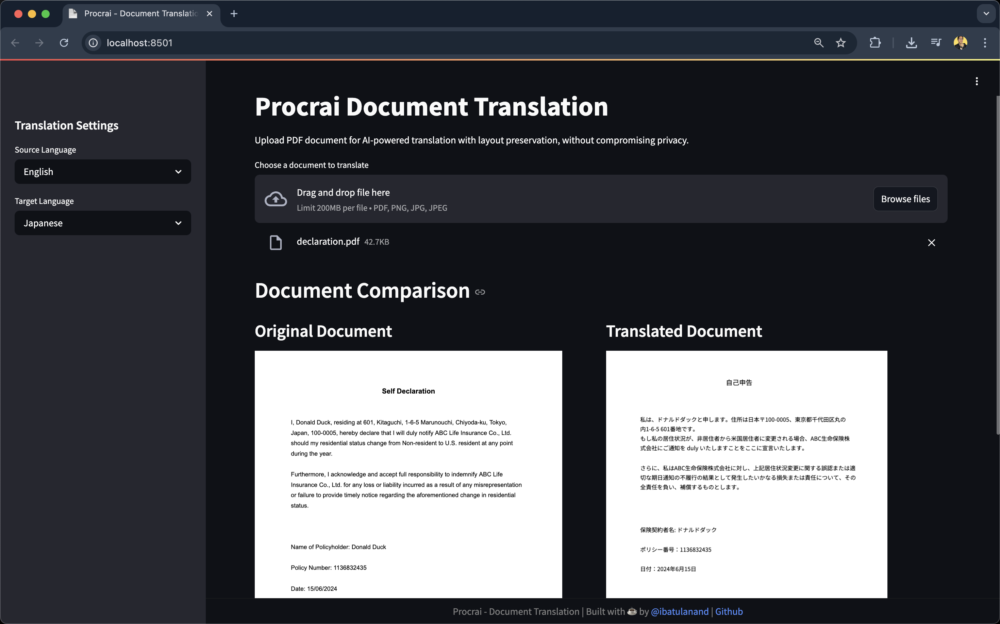

# Procrai
**Enterprise-Grade Document Translation without compromising Privacy**

Procrai is a revolutionary document translation platform that combines state-of-the-art OCR technology with powerful LLMs to deliver precise, layout-preserving translations while ensuring complete data privacy. Born from a real-world need to securely translate sensitive financial documents, Procrai addresses the critical gap in the market for private, enterprise-grade document translation solutions.

## Why Procrai?

Traditional translation services compromise security by requiring document uploads to third-party servers. Procrai eliminates these risks by enabling:

- 🔒 **Complete Data Privacy**: Process documents entirely on your local infrastructure
- 📊 **Layout Preservation**: Maintains exact document formatting and structure
- 🤖 **AI-Powered**: Leverages cutting-edge LLMs for accurate, context-aware translations

## Demo


## Real-World Applications

- **Financial Services**: Translate quarterly reports, investment documents, and financial statements while maintaining data sovereignty
- **Legal Sector**: Process international contracts and legal documents with confidence in data security
- **Healthcare**: Translate medical records and research papers while complying with privacy regulations
- **Government**: Handle sensitive diplomatic and policy documents with complete control over data
- **Research**: Translate academic papers and technical documentation while preserving complex formatting

## Technical Specifications

### Currently Supported
- **Languages**: English ↔ Japanese (bidirectional translation)
- **Document Types**: PDF documents with text and basic layouts
- **OCR Engine**: Tesseract OCR
- **LLM Models**: Local open-source models (Gemma3, Llama, Mistral)
- **Processing**: Local processing with complete data privacy

### Coming Soon
- **Language**: Support for major languages including Chinese, Korean, Spanish, French, and German
- **OCR Engines**: Integration with additional OCR solutions (easyOCR, MistralOCR)
- **Document Types**: Enhanced support for complex documents with:
  - Multi-column layouts
  - Complex tables and charts
  - Mathematical equations
  - Handwritten text recognition
  - Translation of Images in the document
- **LLM Models**: Support for closed-source models (GPT-4, Claude, Gemini)
- **Processing**: Cloud-based secure processing option (in a secure sandbox) with ultimate privacy
- **Editing Capabilities**: Support for editing the output document to adjust text or other components

## Prerequisites

- Python 3.9+
- Poetry (for dependency management)
- Tesseract OCR (for image processing)
- Ollama (for running local LLMs)

## Installation

1. Clone the repository:
   ```bash
   git clone https://github.com/ibatulanandjp/procrai.git
   cd procrai
   ```

2. Install Tesseract OCR:
   ```bash
   # On macOS
   brew install tesseract

   # On Ubuntu/Debian
   sudo apt-get install tesseract-ocr

   # On Windows
   # Download and install from https://github.com/UB-Mannheim/tesseract/wiki
   ```

3. Install Ollama (for running local LLMs):
   ```bash
   # On macOS/Linux
   curl https://ollama.ai/install.sh | sh

   # On Windows
   # Download and install from https://ollama.ai/download
   ```

4. Set up the Python environment:
   ```bash
   # Create and activate virtual environment
   python -m venv venv
   source venv/bin/activate  # On Windows: venv\Scripts\activate

   # Install dependencies
   cd src/backend
   poetry install
   ```

## Configuration

1. Backend configuration:
   ```bash
   # Copy and edit the environment file
   cp src/backend/.env.example src/backend/.env
   ```

## Running the Application

Run both frontend and backend with a single command

```bash
# Make the start script executable
chmod +x scripts/start.py

# Run the application
./scripts/start.py
```

Access the Procrai App at `http://localhost:8501`

## API Documentation

The API documentation is available at `http://localhost:8000/api/v1/docs` when the backend server is running. It provides detailed information about:
- Available endpoints
- Request/response formats
- Authentication requirements
- Example usage

## Contributing

1. Fork the repository
2. Create a feature branch
3. Commit your changes
4. Push to the branch
5. Create a Pull Request

## License

This project is licensed under the MIT License - see the [LICENSE](LICENSE) file for details.
